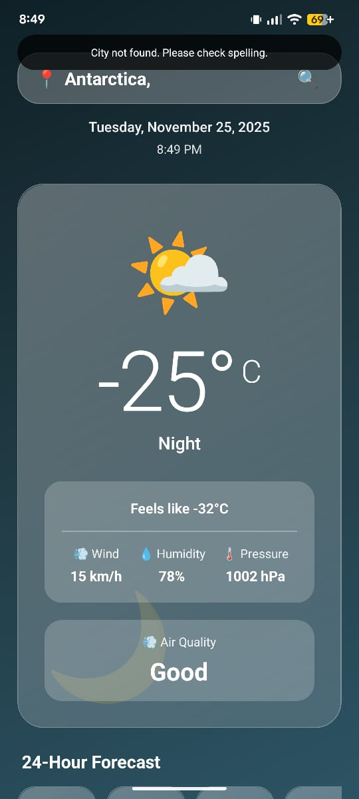
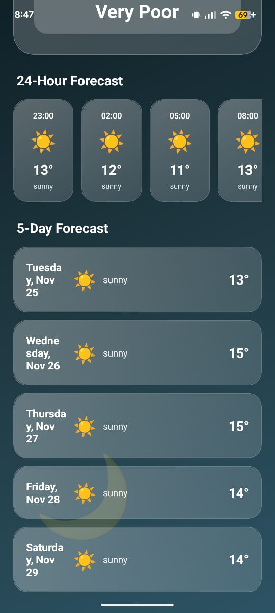
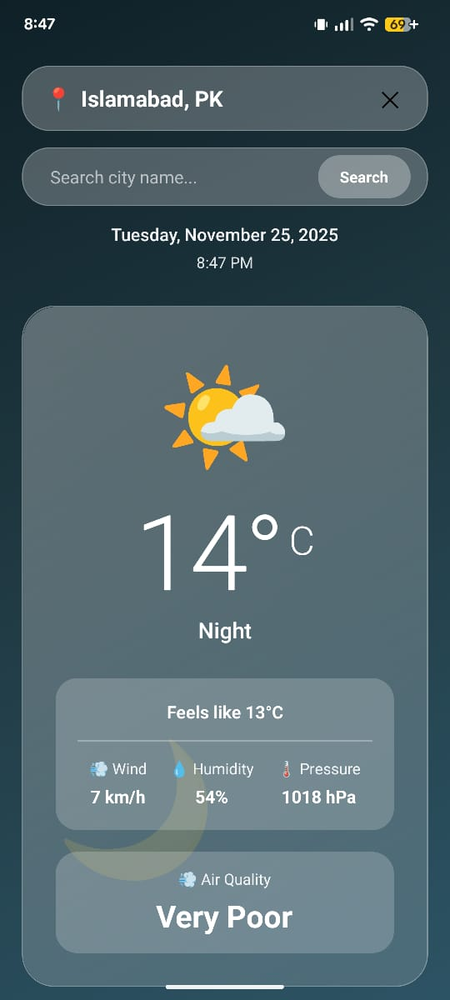
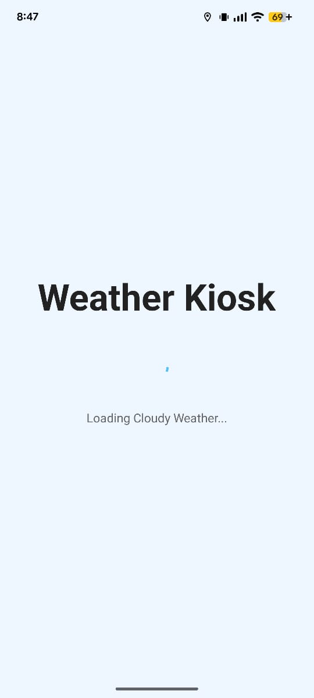
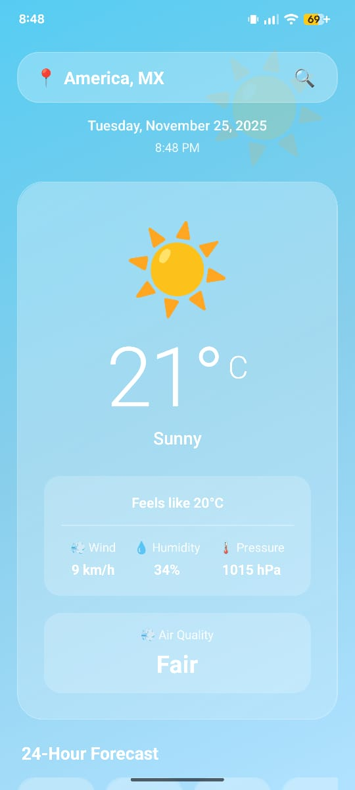

# Weather Kiosk - React Native Expo App 🌤️

**Website se React Native Expo app mein convert kiya gaya hai!**

## ✨ Features

- 🔍 **Search weather by city name** (text input with search button)
- 📍 Real-time location-based weather data
- 🌡️ Current temperature with feels-like, humidity, wind speed
- 🌅 Sunrise and sunset times
- ⏰ 12-hour forecast
- 📅 5-day weather forecast
- 💾 **Saves last searched city** (automatically loads on app restart)
- 🚨 Error handling for city not found & no internet
- 🎨 Dynamic theme based on weather conditions
- 🔄 Pull to refresh functionality
- 📱 Works on Android, iOS, and Web

## 🚀 Quick Start

### Prerequisites
- Node.js installed
- Expo CLI installed globally: `npm install -g expo-cli`
- Expo Go app on your phone (for testing)

### Step 1: Install Dependencies
```bash
cd "s:\MBLE CMP\kiosk_weather_expo"
npm install
```

### Step 2: Add API Key
1. Copy `.env.example` to `.env`
2. Get free API key from: https://openweathermap.org/api
3. Add your key:
```
VITE_OPENWEATHER_API_KEY=your_actual_api_key
```

### Step 3: Start Expo
```bash
npm start
# or
expo start
```

### Step 4: Run on Device/Emulator
- **Android**: Press `a` or scan QR with Expo Go app
- **iOS**: Press `i` or scan QR with Camera app
- **Web**: Press `w`

## 📁 Project Structure

```
kiosk_weather_expo/
├── App.js                      # Main entry point
├── app.config.js               # Expo configuration
├── package.json                # Dependencies
├── .env.example                # Environment variables template
└── src/
    ├── components/
    │   ├── Header.js           # Time, date, location header
    │   ├── CurrentWeather.js   # Current weather card
    │   ├── MainWeatherDisplay.js  # Main temperature display
    │   ├── HourlyForecast.js   # Hourly forecast scroll
    │   ├── FiveDayForecast.js  # 5-day forecast list
    │   └── SplashScreen.js     # Loading screen
    ├── pages/
    │   └── WeatherDashboard.js # Main dashboard page
    ├── context/
    │   └── WeatherContext.js   # Weather data & state management
    └── helpers/
        └── weatherHelpers.js   # Utility functions
```


## 🛠️ Technology Stack

- **React Native** - Mobile framework
- **Expo** - Development platform
- **expo-location** - Location services
- **expo-constants** - Environment variables
- **@react-native-async-storage/async-storage** - Local storage for last searched city
- **OpenWeatherMap API** - Weather data (current, forecast, air quality)

## 📱 Screenshots

### How to Capture Screenshots:
1. Run the app: `npm start` then press `a` for Android or `i` for iOS
2. Take screenshots of the following screens:
   - **Main screen** with current weather (showing temperature, conditions, wind, humidity)
   - **5-Day Forecast** screen (scroll down to show forecast)
   - **Error screen** (turn off internet or search for invalid city like "zzzzz")
   - **Search feature** (tap search icon and show city search input)
3. Save screenshots to `screenshots/` folder with descriptive names
4. Add screenshots below:

### Required Screenshots:

#### 1. Main Weather Screen

*Shows current temperature, weather conditions, wind speed, humidity, and location*

#### 2. 5-Day Forecast

*Displays 5-day weather forecast with temperatures and conditions*

#### 3. City Search Feature

*Text input for searching weather by city name*

#### 4. Error/No Network Screen

*Shows error handling when city not found or no internet connection*
#### 4. Diffrent Location/Day Screen

*Shows error handling when its day time  or night*


## 🐛 Troubleshooting

| Issue | Solution |
|-------|----------|
| "Missing API key" | Add key to `.env` and restart Expo |
| Location permission denied | Allow location in phone settings |
| Expo Go won't connect | Ensure phone & PC on same WiFi |
| White screen | Check terminal for errors |
| "City not found" | Check spelling or try another city name |
| Last city not loading | Clear app data and search again |

## 🎨 Customization

### Change Colors
Edit `WeatherDashboard.js` → `getBackgroundColor()` function

### Add More Weather Details
Edit `MainWeatherDisplay.js` and add more items to the details grid

### Modify Forecast Count
Edit `WeatherContext.js`:
- `buildHourly()` - change `.slice(0, 8)` for more/less hours
- `buildDaily()` - change `.slice(0, 5)` for more/less days

## 📦 Build for Production

### Android APK
```bash
expo build:android
```

### iOS IPA
```bash
expo build:ios
```

### Standalone App
```bash
eas build --platform all
```

## 📦 Creating Submission ZIP

To create a ZIP file for submission (excluding node_modules):

### Windows (PowerShell):
```powershell
# Navigate to parent directory
cd "s:\MBLE CMP"

# Create ZIP (requires 7-Zip or compress utility)
Compress-Archive -Path "weather_App-MC\*" -DestinationPath "weather_App-MC.zip" -Force -CompressionLevel Optimal
```

### Or manually:
1. Copy the entire `weather_App-MC` folder
2. Delete the `node_modules/` and `.expo/` folders from the copy
3. Zip the remaining files
4. Ensure ZIP includes: `src/`, `assets/`, `package.json`, `README.md`, `App.js`, etc.

## 🔗 Links

- OpenWeather API: https://openweathermap.org/api
- Expo Docs: https://docs.expo.dev
- React Native Docs: https://reactnative.dev

---

